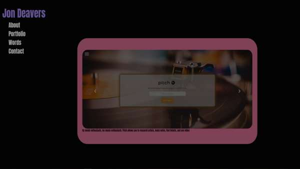

# Jon Deavers - Profile

Deployed site: https://lucsedirae.github.io/

This website is a student profile page. It features a fun, animated user 
interface and intuitive navigation. On the page you will find links to Jon's 
portfolio projects and blog articles, contact information, and a short bio. 
Below are descriptions of components built and tools used in this application. 

## Built with an intentional design philosophy

As I refactored this site I wanted to practice more than just what gets rendered 
by the browser. With that goal in mind, I set the following guidelines for myself 
* Responsive design to perform consistently regardless of device screen size.
* Written with semantic HTML always top of mind to expand accessibility
* Maximize compatibility and reliability by validating through https://validator.w3.org/ 
* Be mindful of code economy and produce a **dry** codebase
* Document with comments thoroughly so that fellow developers can follow my design and logic easily. 

## Featuring HTML Framework [Bootstrap](https://getbootstrap.com/) 4.5.2

[Bootstrap's](https://getbootstrap.com) grid system made positioning elements effortless. The carousel component built-in 
to Bootstrap is incorporated on the portfolio section to provide subtle and intuitive control 
of the slideshow while maintaining the minimalist aesthetic of the user interface.    

## Featuring [anime.js](https://animejs.com/) animation library

"[Anime.js](https://animejs.com/) (/ˈæn.ə.meɪ/) is a lightweight JavaScript animation library with a simple, yet  
powerful API. It works with CSS properties, SVG, DOM attributes and JavaScript Objects." 
-*anime.js homepage*

I incorporated anime.js because I wanted to add some style and character to keep the user engaged 
and interested in exploring the site without distracting from the navigation and content. The 
learning curve was brief with anime.js and I was able to fade color changes in and out on my  navigation column.

## Contact
Thank you for viewing my profile. 
Feel free to contact me with questions or feedback via: 
 
Email: jondeavers@gmail.com 
Twitter: [@jondeavers](https://twitter.com/jondeavers) 
GitHub: [LucSedirae](https://github.com/lucsedirae) 
